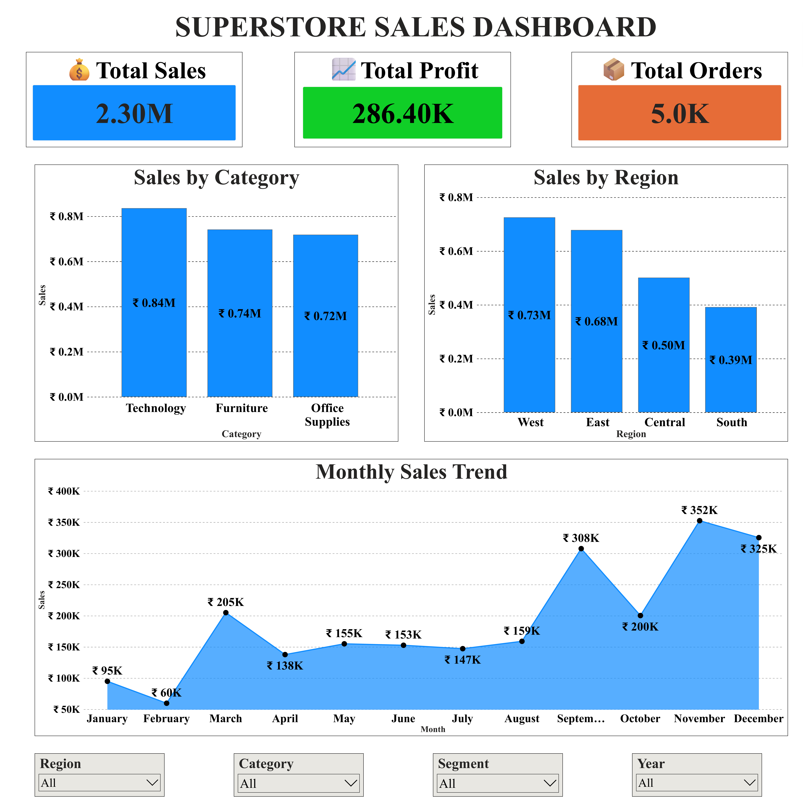
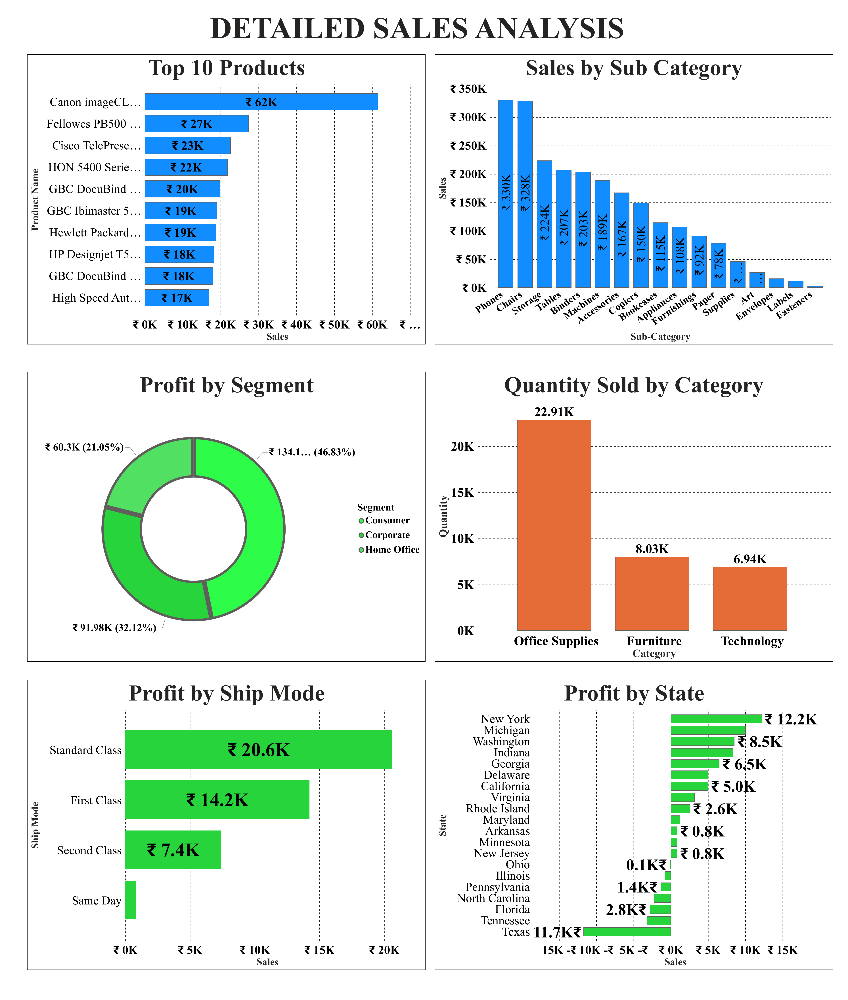

#  Superstore Sales Dashboard

##  Project Overview

This project presents an interactive **Power BI Sales Dashboard** built using the Superstore Sales dataset. The dashboard provides key business insights into sales performance, profitability, customer segments, shipping methods, product categories, and regional performance.

The objective of this project is to help business users monitor sales performance, identify profitable areas, and support data-driven decision making through interactive visualizations.

---

#  Business Objectives

* Analyze overall sales and profit performance.
* Identify top-performing product categories and products.
* Compare sales across different regions.
* Monitor monthly sales trends.
* Understand profit contribution by customer segment.
* Evaluate profitability by shipping mode.
* Analyze quantity sold across categories.

---

#  Tools & Technologies

* Microsoft Power BI
* Power Query
* Data Modeling
* DAX (Basic)
* CSV Dataset

---

#  Dataset Information

* **Dataset:** Sample Superstore Sales Dataset
* **Records:** 9,994
* **Columns:** 21

The dataset contains information related to:

* Orders
* Customers
* Products
* Categories
* Regions
* Sales
* Profit
* Quantity
* Discounts
* Shipping

---

#  Executive Dashboard

The Executive Dashboard provides a high-level overview of business performance through Key Performance Indicators (KPIs) and trend analysis.

### Dashboard Features

* Total Sales
* Total Profit
* Total Orders
* Sales by Category
* Sales by Region
* Monthly Sales Trend
* Interactive Slicers

  * Region
  * Category
  * Segment
  * Year

### Dashboard Preview



---

#  Detailed Sales Analysis

The Detailed Analysis page provides deeper insights into product performance and profitability.

### Dashboard Features

* Top 10 Products
* Sales by Sub-Category
* Profit by Customer Segment
* Quantity Sold by Category
* Profit by Ship Mode
* Profit by State

### Dashboard Preview



---

#  Key Business Insights

* Technology generates the highest sales among all product categories.
* The West region contributes the highest overall sales.
* Monthly sales show significant growth towards the end of the year.
* Office Supplies records the highest quantity sold.
* Standard Class shipping generates the highest profit.
* Consumer customers contribute the largest share of total profit.
* A few products contribute significantly more sales than the remaining products.

---

#  Project Structure

```
Superstore-Sales-Dashboard
│
├── Superstore Dashboard.pbix
├── Sample_Superstore_Cleaned_UTF8.csv
├── README.md
│
└── images
      ├── executive_dashboard.png
      └── detailed_dashboard.png
```

---

#  How to Use

1. Download the repository.
2. Open **Superstore Dashboard.pbix** using Microsoft Power BI Desktop.
3. Refresh the dataset if prompted.
4. Explore the dashboard using the interactive slicers.

---

#  Skills Demonstrated

* Data Cleaning
* Data Visualization
* Dashboard Design
* Business Intelligence
* KPI Reporting
* Interactive Filtering
* Business Insight Generation

---

#  Conclusion

This dashboard demonstrates how Power BI can transform raw sales data into meaningful business insights. By combining KPI cards, interactive filters, trend analysis, and comparative visualizations, the dashboard enables users to quickly understand business performance and make informed decisions.

---

#  Author

**Gulam Muddasir Farooqui**

Aspiring Data Analyst

**Skills:** Python | SQL | Power BI | Excel

---

 If you found this project useful, feel free to star the repository.
